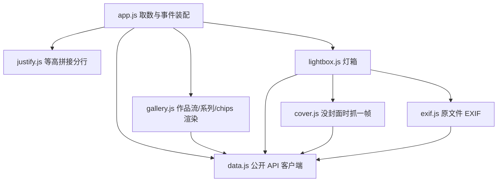

# Collection of Time · Photography

一个**零依赖**的摄影作品集框架：后端只用 Python 标准库提供 JSON API，
前端只负责渲染（原生 HTML / CSS / JavaScript ES Module），
内置相册分类浏览、标签搜索筛选、EXIF 元数据展示与灯箱大图查看，
并支持**照片与视频混合浏览**（本地视频文件 + YouTube / 哔哩哔哩 / Vimeo / 抖音 / 小红书等外链，点开跳原站）。

> **架构取向：逻辑在后端，前端只渲染。**
> 搜索、筛选、排序、分页、校验、EXIF 解析与格式化、表单字段定义、上传调度
> 全部由 Python 端完成，浏览器端不含这些业务规则（详见「前后端契约」一节）。

---

## 快速开始

```bash
cd CollectionOfTime/Photography
python serve.py          # 默认 http://127.0.0.1:8000，会自动打开浏览器
```

> `serve.py` 既是静态服务器，也提供与正式后台**完全相同**的公开只读接口
> （`/api/public/*`），所以单独预览作品集只需要它一个。
> 用 `admin.py` 启动时同样自带这些接口。
>
> ⚠️ 作品集的数据现在由后端接口提供，**不再直接读取 `data/*.json`**，
> 因此纯静态服务器（`python -m http.server`、`npx serve`、GitHub Pages 等）
> 无法完整呈现列表与筛选——请用 `serve.py`，或把静态目录与 `/api/public/*`
> 放在同一个源下（例如同一台 nginx 反代到 `admin.py`）。
> 另外**不要直接双击 `index.html`**：`file://` 协议下浏览器会拦截 `fetch`。

---

## 一键运行（run.sh）

`run.sh` 把「环境自检 → 装 FFmpeg → 建账号 → 启动服务」收成一条命令，
专为**部署到 Linux 服务器**准备（Windows 请在 WSL 或 Git Bash 里执行）。

```bash
cd CollectionOfTime/Photography
chmod +x run.sh          # 首次
./run.sh                 # 或 ./run.sh setup —— 首次部署一条龙
```

| 命令 | 作用 |
| --- | --- |
| `./run.sh setup` | 首次部署：环境自检 + 安装 FFmpeg + 启动 |
| `./run.sh start` | 后台启动（日志写入 `.run/admin.log`） |
| `./run.sh stop` / `restart` | 停止 / 重启 |
| `./run.sh status` | 运行状态、运行时长、FFmpeg 来源、数据条数 |
| `./run.sh logs [-f]` | 查看日志（`-f` 持续跟踪） |
| `./run.sh doctor` | 环境自检：Python 版本、必需文件、写权限、JSON 合法性、上游代码是否被本地改动、端口占用 |
| `./run.sh net-check` | 自检外链封面抓取要用的域名能否连上（出网问题一眼看清） |
| `./run.sh link-check` | 检查所有外链视频「还在不在」，结果写进 `.run/link-status.json`（后台「检查外链」按钮同款） |
| `./run.sh faststart [--check]` | 把 MP4/MOV 的索引挪到文件开头（边下边播）：`-c copy` 不重新编码，就地原子替换；`--check` 只列出待处理文件 |
| `./run.sh prune-media` | 清理「悬空引用」（条目指向已删的文件，前台显示「缺失」）与「孤儿文件」（媒体目录里没人引用的散图）；默认只演练，加 `--delete` 才动手（删条目走 `store`，动手前自动备份） |
| `./run.sh install-ffmpeg` | 下载 FFmpeg 静态构建到 `bin/`（可透传 `--check` / `--file` / `--url` 等） |
| `./run.sh create-user` / `reset-password` | 创建管理员 / 重置密码 |
| `./run.sh systemd [--install]` | 生成 systemd 单元（加 `--install` 需 root，直接写入并启用） |
| `./run.sh update` | **手动**更新代码：拉取 → 只换代码路径 → 重启 → 健康检查，失败自动回滚（`--check` 只检查不改动） |
| `./run.sh update-check on\|off\|status` | 可选：定时检查有没有新代码，**只提醒不执行**；详见 [DEPLOY.md「在服务器上更新代码」](./DEPLOY.md) |
| `./run.sh adopt --repo URL` | 把迁移包部署的目录就地接管成 git 检出（更新需要它；不动 `data/`、上传内容与 `admin.config.json`，`assets/css` `assets/js` 这类代码会被对齐到远端） |

启动参数可覆盖默认值（也支持环境变量）：

```bash
./run.sh start --port 9000 --host 0.0.0.0 --session-hours 8
PORT=9000 HOST=127.0.0.1 ./run.sh start
```

| 环境变量 | 默认值 | 说明 |
| --- | --- | --- |
| `PORT` | `8080` | 监听端口 |
| `HOST` | `127.0.0.1` | 监听地址（保持默认即可，见下方部署说明） |
| `SESSION_HOURS` | `12` | 会话有效期（小时） |
| `PYTHON` | 自动探测 | 指定解释器（需 3.9+） |
| `ADMIN_USERNAME` | `admin` | 非交互建号的用户名 |
| `ADMIN_PASSWORD` | — | 非交互建号的密码（至少 8 位） |
| `FFMPEG_URL` | — | 内网 FFmpeg 镜像地址 |

**无交互部署**（CI、容器、Ansible 等）只要给上账号密码，就不会弹任何提示：

```bash
ADMIN_USERNAME=me ADMIN_PASSWORD='你的密码' ./run.sh setup
```

脚本的几个贴心之处：

- 启动后**轮询 `/api/health` 直到真正就绪**才报成功，而不是「进程起来了就算成功」；
- 启动前检查端口是否被占用，并告诉你占用它的是谁；
- 重复执行 `start` 会提示已在运行，不会起出第二个实例；
- 没装 FFmpeg 时只警告不阻断，并提示修复命令；
- `stop` 先发 `SIGTERM`，最多等 10 秒再 `SIGKILL`。

---

## 打包与迁移到服务器

打包就是一条命令：

```bash
./run.sh package
```

产出一个自包含的 `dist/photography-linux-x64-<日期>-<时间>.tar.gz`，**解压即可运行**，
连 FFmpeg 静态构建都已在 `bin/` 里，服务器上无需 `apt install`、无需 `pip install`。

```bash
# 本地：上传
scp dist/photography-linux-x64-*.tar.gz* user@服务器:/tmp/

# 服务器：解压 + 跑起来
cd /tmp && sha256sum -c photography-linux-x64-*.tar.gz.sha256
sudo tar -xzf photography-linux-x64-*.tar.gz -C /opt
cd /opt/photography-linux-x64-* && chmod +x run.sh
./run.sh doctor          # 先自检
./run.sh setup           # 建号 + 启动
```

详细的服务器步骤、HTTPS 反代、systemd、升级与排查见包内的 **`DEPLOY.md`**。

### 打包参数

| 参数 | 说明 |
| --- | --- |
| `--platform <名字>` | 目标平台，默认 `linux-x64`（可选 `linux-arm64`、`linux-armhf`、`windows-x64`、`darwin-x64`） |
| `--out <目录>` | 输出目录，默认 `dist/` |
| `--no-ffmpeg` | 不打包 FFmpeg（服务器已装，或想自己放） |
| `--with-config` | 连 `admin.config.json` 一起打包，沿用现有账号密码 |
| `--keep-stage` | 保留组装用的临时目录，便于排查 |

### 包里有什么

除了完整代码，还多两份东西：

- **`PACKAGE-INFO.txt`**：打包时间、目标平台、包内 FFmpeg 版本、**三份 JSON 的条数与 sha256**。
  到了服务器上 `cat` 一下就能核对数据有没有在传输中损坏。
- **`DEPLOY.md`**：从建号到 systemd 常驻、从升到备份到排查的完整手册。

### 默认不打包什么

| 排除项 | 原因 |
| --- | --- |
| `admin.config.json` | 含密码哈希与会话密钥；到服务器上 `./run.sh create-user` 重新建号更干净 |
| `.run/`、`dist/`、`__pycache__/`、`*.pyc`、`*.log` | 运行时产物 |
| `data/.backups/` | 开发机上的历史备份，带过去没意义 |
| 另一种命名约定的 `ffmpeg.exe` / `ffmpeg` | 属于别的平台，白白占几十 MB |

需要连账号一起搬过去时加 `--with-config`。

### 打包时会做的检查

- 逐个确认必需文件齐全，缺了就中止并列出来；
- 核对 `bin/` 里的 FFmpeg 是不是目标平台的：扩展名不符直接排除，
  有 `file` 命令时还会提示「看着像 ARM 却要打 x64」这类疑惑；
- 生成 sha256 校验单，方便传到服务器后比对；
- 保留 `run.sh` 与 `bin/ffmpeg` 的可执行位——解压后无需额外 `chmod` 就能跑。

---

## FFmpeg 集成

FFmpeg 是**可选依赖**：没有它后台照样能用，只是跳过缩略图与视频封面生成。
为了让它能在没有 root、也不方便 `apt install` 的机器上工作，查找按优先级进行：

| 优先级 | 位置 | 说明 |
| --- | --- | --- |
| 1 | `COT_FFMPEG` / `COT_FFPROBE` 环境变量 | 指向任意位置的二进制（系统包、自编译版本） |
| 2 | 项目内 `bin/ffmpeg`、`bin/ffprobe` | 随项目一起打包，服务器上无需安装 |
| 3 | 系统 `PATH` | 已 `apt install ffmpeg` 时直接复用 |

后台「概览」页会显示实际来源（环境变量指定 / 项目内置 / 系统 PATH）、路径与版本号。

### 安装到 bin/

```bash
python tools/fetch_ffmpeg.py            # 自动识别平台，下载静态构建并解出到 bin/
python tools/fetch_ffmpeg.py --check     # 只看当前状态，不下载
```

支持 `linux-x64`、`linux-arm64`、`linux-armhf`、`windows-x64`、`windows-arm64`、`darwin-x64`。
解压时**按名字精确提取** `ffmpeg` / `ffprobe`，不做整包解压，天然免疫压缩包路径穿越。

| 参数 | 说明 |
| --- | --- |
| `--platform <名字>` | 为其它平台准备分发包（如 `windows-x64`），默认自动识别 |
| `--file <压缩包>` | 用本地压缩包，完全离线（`.tar.xz` / `.zip` 均可） |
| `--url <地址>` | 指向内网镜像，也支持 `file://` |
| `--sha256 <哈希>` | 校验压缩包，不匹配就中止且不覆盖已有文件 |
| `--dest <目录>` | 安装到别处（默认 `bin/`） |
| `--force` | 覆盖已存在的文件 |
| `--keep-archive` | 保留下载的压缩包，便于分发给其它机器 |

安装后脚本会自己跑一次 `-version`，确认二进制**真能执行**；架构不匹配时会在安装阶段就报出来，
而不是等你上传视频才发现。

### 打包到服务器

`bin/` 目录下的二进制已被 `.gitignore` 排除（只保留说明文件），所以走实际部署流程时：

```bash
# 在开发机上为目标平台准备（例如服务器是 x86_64 Linux）
python tools/fetch_ffmpeg.py --platform linux-x64

# 连二进制一起传过去
rsync -av --exclude '.run' --exclude 'admin.config.json' Photography/ user@server:/opt/photography/

# 服务器上确认
cd /opt/photography && ./run.sh doctor
```

> **信任提示**：默认下载源是第三方提供的静态构建（Linux 用 johnvansickle.com，
> Windows 用 BtbN 的 GitHub Release，macOS 用 evermeet.cx）。对来源有要求时，
> 请自行编译或用发行版包，然后通过 `COT_FFMPEG` / `COT_FFPROBE` 指向，
> 或者把校验过的压缩包放进项目用 `--file` 安装。

---

## 内容后台（admin.py）

一个**只用 Python 标准库**的内容后台，采用前后端分离结构：

- **后端** `admin.py` + `adminlib/`：提供 JSON API 与（可选的）静态资源，
  并承担全部业务逻辑——搜索/筛选/排序/分页（`adminlib/query.py`）、
  表单字段定义与字段级校验（`adminlib/schema.py`）、认证、上传与落盘；
- **前端** `admin/`：纯静态的薄客户端，只做三件事——取值、拼 HTML、绑事件。可独立部署。

服务器上不需要 `pip install` 任何东西。

```bash
python admin.py --create-user         # 首次：创建管理员账号
python admin.py                       # 启动，默认 http://127.0.0.1:8080/admin/
python admin.py --port 9000 --session-hours 8
python admin.py --print-systemd       # 生成 systemd 单元文件
```

打开 `http://127.0.0.1:8080/admin/`，用刚创建的账号登录即可。

### 能做什么

| 模块 | 能力 |
| --- | --- |
| 概览 | 条目计数、FFmpeg 状态、**数据完整性体检**（失效相册引用 / 缺失媒体文件）、最近操作 |
| 照片 / 视频 / 相册 | 列表筛选、新增、编辑（含 EXIF 分组表单）、删除（可选同时删除媒体文件）；**视频可发外链**（YouTube / 哔哩哔哩 / Vimeo / 抖音 / 小红书 / 任意地址，站内不播放、点卡片跳原站），封面在表单里直接上传或自动抓取（抖音 / 小红书只能手动上传），右侧「检查外链」可批量确认链接是否还有效 |
| 上传 | 拖拽或点选多文件、**一次请求批量上传**、**进度条 + 实时网速与剩余时间**、指定相册与标签、**自动读取 EXIF 填充拍摄参数**、ffmpeg 生成缩略图，视频默认抓取第一帧作为封面（也可直接上传封面图片） |
| 备份 | 一键导出 JSON、导入（覆盖 / 按 id 合并）、回滚任意一次自动备份 |
| 账号 | 修改密码（侧边栏用户卡片也有入口）、退出登录、会话信息 |

### 登录与认证

登录页是后台的唯一入口，认证做了这几件事：

| 项目 | 实现 |
| --- | --- |
| 密码存储 | PBKDF2-HMAC-SHA256，30 万次迭代 + 16 字节随机盐，只存哈希 |
| 会话 | 服务端 HMAC-SHA256 签名的令牌，默认 12 小时有效（`--session-hours`） |
| 会话 Cookie | `HttpOnly` + `SameSite=Strict`，前端 JS 读不到令牌 |
| CSRF | 双提交：可读的 `cot_csrf` Cookie 必须回填到 `X-CSRF-Token` 头，所有写操作都校验 |
| 登录限流 | 同一「IP + 用户名」在 5 分钟内失败 5 次即锁定 5 分钟，锁定期间密码正确也拒绝 |
| 改密 | 需要校验当前密码；改密后**其它设备的所有会话立即失效** |
| 账号枚举防护 | 用户不存在时也走一次哈希运算，避免通过响应耗时区分 |

首次使用有三种建号方式：

```bash
python admin.py --create-user                        # 命令行交互创建
ADMIN_USERNAME=me ADMIN_PASSWORD='...' python admin.py --create-user   # 非交互
./run.sh create-user                                 # 同样支持上面两个环境变量
```

或者直接打开后台界面，会引导你创建（只在还没有账号时可用）。
忘记密码时在服务器上重置：

```bash
python admin.py --reset-password
ADMIN_PASSWORD='新密码' ./run.sh reset-password        # 非交互
```

账号与会话密钥保存在 `admin.config.json`（权限 `0600`，已在 `.gitignore` 中忽略）。

### 前后端分离与 API

前端通过 `admin/js/config.js` 决定接口地址，默认同源（空字符串）。
要指向另一台服务器，改 `admin/index.html` 里的 meta 即可，**前端代码无需改动**：

```html
<meta name="api-base" content="https://api.example.com" />
```

跨域时后端需要加白名单（带 Cookie 的跨域必须回具体 Origin，不能用 `*`）：

```bash
python admin.py --host 0.0.0.0 --allow-origin https://admin.example.com
```

> CSP 的 `connect-src` 只允许同源。用 `--allow-origin` 指定的源会被自动加进 `connect-src`，
> 因此跨源调用 API 只需按上面的方式声明一次；若前端改用别的域（例如静态站放在 CDN），
> 需要把该域也写进 `--allow-origin`，否则浏览器会以 CSP 违规拦掉 fetch。

主要接口（完整字段说明见「前后端契约」一节）：

**公开只读接口（无需登录，作品集前端使用）**

| 接口 | 说明 |
| --- | --- |
| `GET /api/public/site` | 首屏：统计、相册总览、筛选项（相册/标签聚合）、排序与类型选项 |
| `GET /api/public/gallery` | 作品列表；`q` / `type` / `album` / `tags` / `sort` / `page` / `pageSize` 全在服务端处理 |
| `GET /api/public/albums` | 相册总览（含条目数与封面兜底） |
| `GET /api/public/exif?path=…` | 解析原文件 EXIF（取代浏览器端解析器；仅限照片目录） |
| `GET /api/health` | 健康检查 |

**后台接口（需要会话，写操作另需 CSRF 头）**

| 接口 | 说明 |
| --- | --- |
| `GET /api/auth/session` | 当前登录状态、是否需要初始化、并下发 CSRF Cookie |
| `POST /api/auth/setup` | 首次创建管理员（仅在无账号时可用） |
| `POST /api/auth/login` | 登录 |
| `POST /api/auth/logout` | 退出 |
| `POST /api/auth/password` | 修改密码 |
| `GET /api/schema` | 表单字段定义、排序项、列定义、上传限制（前端不再内置这些） |
| `GET /api/items/{集合}` | 表格数据：`q` / `album` / `tag` / `sort` / `page` / `pageSize` 服务端处理，返回**已算好**的单元格 |
| `GET /api/item/{集合}/{id}` | 单条详情，`values` 为已摊平的表单值，直接填控件 |
| `POST /api/items/{集合}` | 新增 / 编辑；校验失败返回 400 + `fieldErrors[{field,message}]` |
| `DELETE /api/items/{集合}/{id}[/file]` | 删除条目；加 `/file` 同时删除媒体文件 |
| `POST /api/upload` | **批量**上传（字段 `files` 可重复；可另带 `posterFile` 作为本批视频的封面）；逐文件返回结果，失败不影响其它文件。**整批全失败时回 400**（body 里仍带 `results` 与 `summary`），部分成功回 200 + `summary.failed` |
| `POST /api/videos/{id}/poster` | 为某个视频设置封面：上传图片（`file`）或抓帧（`time`，默认 0 = 第一帧）。带 `onlyIfMissing=1` 时「已经有封面」就直接返回 `{skipped: true}`（站点页面自动补封面用，见 `cover.js`） |
| `POST /api/assets/poster` | 上传一张封面素材（`file`，仅图片），返回 `{path, url}` —— 给「新增视频」用：条目还没有 id，先拿路径再回填表单 |
| `POST /api/assets/thumb` | 按 `{provider, src}` 自动抓取外链视频封面（仅白名单域名、见「外链封面的自动获取」）；`--no-net-fetch` 时返回 400 |
| `POST /api/assets/check-links` | 批量检查所有外链视频「还在不在」，返回 `counts` 与逐条 `results`，结果写进 `.run/link-status.json`（见「外链『还在不在』」）；`--no-net-fetch` 时返回 400 |
| `POST /api/links/inspect` | `{src}` → 按链接识别「来源」：`{provider, providerLabel, videoId, watchUrl, note, fetchable}`。后台表单用它实时显示来源（只读），保存时服务端再认一次 |
| `GET /api/upload/options` | 上传限制（单文件 / 单批上限）、可选相册、允许的扩展名 |
| `GET /api/state` | 概览：计数、工具状态、完整性体检、备份列表（含 `sizeText`）、操作记录 |
| `GET /api/data/{集合}`、`PUT /api/data/{集合}`、`POST /api/data/{集合}` | 兼容保留的集合读写（整表替换 / 单条覆盖） |
| `GET /api/backups`、`POST /api/backups/{名称}/restore` | 列出 / 恢复备份 |
| `GET /api/export`、`POST /api/import` | 导出 / 导入 JSON |

### 前后端契约（薄客户端）

前端不含业务规则，只按后端返回的结构渲染。三条约定：

1. **列表都是「已算好」的单元格**。`GET /api/items/{集合}` 返回 `columns[]`（表头）与
   `items[].cells[]`，每个单元格自带 `kind`，前端只按 `kind` 分发渲染：

   | `kind` | 渲染方式 |
   | --- | --- |
   | `thumb` | `remoteUrl` 或 `url` 作 ``；`missing` / 空值显示 `fallback` 角标 |
   | `title` | 主标题 `text` + 次行 `sub` |
   | `text` / `sub` / `muted` | 文本（普通 / 次要 / 灰色） |
   | `tags` | 标签组 |
   | `badge` | 徽章（`tone` 为 `file` / `embed`） |
   | `actions` | 编辑 / 删除按钮，值为 `"{集合}:{id}"` |

   因此前端**没有**按集合分叉的渲染代码——手机端的卡片布局也复用同一份数据。

2. **表单定义与校验在后端**。`GET /api/schema` 给出字段（`key` / `label` / `type` /
   `required` / `group` / `hint` / `placeholder`）；`GET /api/item/{集合}/{id}` 给出的
   `values` 是**已摊平**的（`exif.camera` 这种扁平键可直接塞进控件）；
   提交时把控件原始值原样 POST 回去，后端负责还原嵌套、类型转换与校验，
   校验失败返回 `400 { ok:false, fieldErrors:[{field,message}] }`，前端按 `field` 标红。

3. **公开端同理**。`/api/public/gallery` 已经把搜索、相册/标签/类型筛选、排序、分页
   做完，并返回可直接展示的 `subtitle` / `dateText` / `durationText` / `exifSummary` /
   `imageMissing` / `watchUrl` / `linkStatusText` 等字段，前端不再拼这些文案。
   其中 `width` / `height` 是从 `exif.dimensions`（照片）或 `resolution`（视频）解析出的
   原始像素数，专供作品流**等高拼接**分行用；取不到时为 `0`，前端按 3:2 兜底。

上传也是「后端调度、前端展示」：`POST /api/upload` 一次可带多个 `files`，
返回 `results[]`（逐个文件的成功/失败与 `warnings`）与 `summary`，
前端只需按 `upload.maxBatchBytes` 分批发送并渲染结果。服务端**流式解析**请求体
（见「内存模型」），单文件 / 单批上限在收的过程中就判，超限立刻中断。

上传进度用 `XMLHttpRequest`（`fetch` 没有上传进度事件）实现：`admin/js/api.js` 的
`uploadWithProgress()` 把 `xhr.upload.progress` 的 `{ loaded, total }` 交给上传面板，
面板显示进度条、百分比、已发字节、**实时网速与剩余时间**；请求体发完到服务端返回之间
（读 EXIF / 生成缩略图与封面）显示「服务端处理中」，完成后给出「共 X，用时 Y，平均 Z/s」。
进度分母是**实际发出的字节**（封面图片每批都会重发一次，因此按「封面大小 × 批次数」计入），
网速取最近 2 秒的滑动窗口，避免瞬时抖动让数字乱跳。

### 安全模型

写操作会改文件，因此默认收敛：

- 默认只监听 `127.0.0.1`，外部访问不到；
- 除公开接口外，所有 API 都要求有效会话；
- 上传有扩展名白名单、单文件 512MB 上限、单批 480MB 上限（**边收边判**，超限立刻中断）；
  文件名还会做**全名所有段**的危险扩展名判定：`shell.php.jpg` 这类双扩展名会被直接拒绝
  （当前架构下它不可利用——静态文件是 Python 按最后一跳给 `Content-Type` 提供的，
  但换个前置服务器就会变成真的执行漏洞，而且这类名字没有正常用途）；
  整批文件**全部**失败时接口回 400（body 里仍带逐条 `results`），不再把 `ok=false` 藏在 200 里；
- **明文 HTTP 访问后台时会提醒**：登录页上方直接标出「明文 HTTP 连接」，登录后再补一条 toast ——
  后台只应通过 HTTPS 反代或 SSH 隧道访问（`Secure` Cookie 与登录口令都依赖这一点）；
- **站点页面唯一一处写数据的路径是「补封面」**（`assets/js/cover.js` → `POST /api/videos/{id}/poster`）：
  本地视频没封面时，第一次播放会抓一帧发上去。三个前提缺一不可 —— 浏览器必须**已有管理员
  会话**（没有就静默不做，访客不写任何数据）、必须带**双提交 CSRF**（`cot_csrf` 可读 Cookie
  对 `X-CSRF-Token`，与后台同一套）、服务端必须处于**该条目没有封面**的状态（`onlyIfMissing=1`，
  已有封面原样返回）。所以它不比「后台换封面」多给任何人任何能力；
- **出网只有一个口子**：外链封面自动抓取与外链状态检查（`adminlib/thumbs.py` 负责实际请求，
  `adminlib/linkcheck.py` 只借它地问官方接口）。两者都**不请求用户填的链接**，
  只访问白名单域名（服务商官方接口 + 缩略图 CDN）、只走 https、拒绝 IP 与 userinfo、
  跳转逐跳校验、单张 6MB、整次 12 秒硬上限；`--no-net-fetch` 可整个关掉；
  **抖音 / 小红书连白名单都没进**（服务端抓不到它们的东西，干脆不给这个能力），
  所以贴这两站的链接时服务端一次网络请求都不会发出去；
- 删除文件前会做路径越界校验，只允许删 `assets/` 下的对应目录；
- 静态资源与 `/admin` 资源都做了路径穿越防护；
- 静态文件走白名单：只有站点根目录的 `index.html` / `favicon.svg` 与 `assets/`、`data/`
  下的文件会对外提供，后端源码、`adminlib/`、`admin.config.json`（含会话密钥）与
  `data/.backups/` 一律返回 404（`admin.py` 与 `serve.py` 用同一份白名单）；
- 禁止目录列表：请求 `/assets/`、`/data/` 这类目录会返回 403，只能取到具体文件；
- 响应头统一带 `X-Content-Type-Options`、`X-Frame-Options`、`Referrer-Policy` 与
  **CSP**（`default-src 'self'`，脚本、样式都只允许外部文件，不用 `unsafe-inline`）；
- `Server` 头只回 `CollectionOfTime`，不暴露 Python 版本与框架信息；
- 登录失败按**真实客户端 IP** + 用户名限流：反向代理下用 `X-Forwarded-For` 的第一跳
  （只有当对端是本机 / 内网地址时才采信，公网直连伪造该头无效），因此反代后面
  每个访客各自计数，别人试错不会把管理员锁在门外；
- **先鉴权再读请求体**：未登录的 `POST/PUT/DELETE` 直接回 401 并断开连接，不碰 body——
  否则任何人都能用一个大 body 把内存顶满（读 body 不需要凭据）；
- `--no-auth` 只在监听本机时才允许使用（本地调试用）。

### 内存模型（小内存机器必读）

服务的内存占用**与上传文件大小无关**，这是刻意的设计：

| 请求 | 峰值 RSS（1.6GB 小机器实测） |
| --- | --- |
| `GET /api/items/*`（全部条目） | +0.2MB |
| 上传 50MB / 150MB / 300MB | +1.4MB（不随大小变化） |
| 未登录的 300MB `POST` | +1.4MB（立即 401，body 不读） |
| 两个 300MB 上传并发 | +1～2MB |
| 导入 10MB JSON 备份 | +50MB（`json.loads` 本身要放大 3~6 倍，故上限 32MB） |

做法：

- 上传体**流式解析**（`adminlib/multipart.py`）：文件 part 边收边写进
  `data/.tmp/`，收完直接 `rename` 到 `assets/` 下的最终位置；内存里只留一个
  `256KB` 的读块与表单字段。标准库的 `email` 解析器要求整个请求体先进内存
  （实测放大 **12 倍**：300MB 上传 → 3.6GB RSS，两个并发 → 7.3GB，1.6GB 的机器必 OOM），
  所以这里手写了边界扫描；part 头部仍交给 `email` 解析，保证中文文件名等细节一致。
- 上传中的临时文件在 `data/.tmp/`（`.` 开头，静态白名单不会外泄）；请求结束统一清理，
  进程被杀留下的残留文件在下次启动时清掉。
- JSON 请求体（导入备份 / 覆盖保存）上限 `MAX_JSON_BYTES = 32MB`，超过直接 413。
- systemd 单元带 `MemoryHigh` / `MemoryMax`（默认 512M，可用
  `--memory-max` 或 `MEMORY_MAX=1G ./run.sh systemd --install` 调整）与 `MemorySwapMax=0`：
  万一真撞上上限，**只影响这个服务**，不会像没有约束时那样被内核 OOM 连累整机。
- 单个 socket 读写的空闲超时 `REQUEST_TIMEOUT = 120` 秒：慢速客户端不会长时间占着线程。

### 静态资源与缓存

- `/api/**` 一律 `no-store`：接口响应不会被缓存；
- HTML 外壳（`/`、`/index.html`、`/admin/`）用 `public, no-cache` + `Last-Modified`：
  **可以存下来，但用之前必须重验证**，没改就回 `304`（以前是 `no-store`，
  每次访问都要重下整份 HTML），改了立刻拿到新的；
- `/assets/**`、`/admin/js|css/**`、`favicon.svg` 用 `public, no-cache`：**允许缓存但每次重验证**，
  命中 `304` 只回响应头，刷新时省掉整包流量（实测首屏 JS/CSS 从 53KB 降到 1.5KB），
  同时改完文件刷新立刻生效——不会出现「长缓存看到旧封面」的问题。
- **例外**：上传的照片（`/assets/img/photos/**`，不含 `thumbs/`）给 `max-age=3600`。
  它们的文件名由 `store.unique_path` 生成、**绝不就地覆盖**（同名上传会变成 `x-1.jpg`），
  所以长缓存是安全的，翻相册时省掉逐张 304 的往返。
- 之所以不给其它文件加 `max-age`+`immutable`：封面、缩略图、视频都是**固定文件名就地替换**的
  （`assets/video/posters/<id>.jpg`、`./run.sh faststart` 重写的 mp4），长缓存会让人看到旧图。
  若将来给文件名加内容指纹，就可以在反代层放心开一年长缓存。
- 把静态文件交给 nginx 托管时（`./run.sh https --static` + 后端 `--no-static`），
  nginx 用 `expires -1` 达到同样效果：命中 304 不传内容，改完立刻生效。
  那一版配置会把前台需要的 CSP / HSTS 等安全头一并写到 `location` 里——
  nginx 的 `add_header` **不与上层合并**，所以每个静态 location 都要重复声明。
- **支持 HTTP Range（`206 Partial Content`）**：`<video>` 想要「能拖动的进度条 + 时长」
  必须先能按字节取片段。只回 200 整份时，浏览器往往拿不到时长（moov 在末尾的 mp4、
  webm、以及大文件），表现就是**播放器没有进度条、不能拖到中间**，而且每次都要重下整份。
  实现在 `adminlib/ranges.py`（单段 `bytes=a-b` / `a-` / `-n`，多段与越界按整份 200 处理），
  `admin.py` 与 `serve.py` 共用；同时修掉了「HEAD 也会回一份 body」的老问题
  （媒体文件的 HEAD 以前会把整个视频写一遍）。交给 nginx 托管时它自带 Range 支持。
- 拖动进度条会让浏览器频繁**中止**在途的媒体响应（`ConnectionReset` /
  `Aborted` / `BrokenPipe`）。这些不是服务端错误，`admin.py` 与 `serve.py` 都静默处理，
  否则一次播放就能往 journald 里灌几十段 traceback、把真错误埋掉。

### 反向代理层的额外防护

`./run.sh https` 生成的配置同时开了：

| 项 | 值 | 作用 |
| --- | --- | --- |
| `limit_req`（`/api/public/*`） | 20 次/秒，burst 40，429 | 挡刷公开接口；正常浏览首屏只 2 个请求 |
| `limit_req`（`/api/auth/login`） | 1 次/秒，burst 5，429 | 与应用层的「5 次失败锁 5 分钟」互补，防撞库 |
| `limit_req`（写接口） | 2 次/秒，burst 20，429 | **只对 POST/PUT/PATCH/DELETE 计数**（`map $request_method`，GET/HEAD 的 key 为空 → nginx 跳过），所以读接口和正常浏览完全不受影响；但「拿不到凭据也硬刷写接口」会被挡住——每个写请求都要落盘 / 调 ffmpeg |
| `client_max_body_size` | 与后端 `MAX_BODY_BYTES` 一致（520m，`--body-limit` / `NGINX_BODY_LIMIT` 可调） | 超限的请求在边缘就被 413 挡掉，不用白跑一趟后端；两边都从代码里推导，不会各自漂移 |
| `error_page 413` | JSON | 边缘的 413 也回 `{"ok":false,"error":…}`，前端显示成人话而不是「响应不是 JSON」 |
| `gzip` | JS/CSS/JSON/SVG/XML | 首屏体积约为原来三成。**`text/javascript` 必须写**：Python 3.12+ 起标准库把 `.js` 映射成它（RFC 9239），只写 `application/javascript` 会导致前端 JS 一个都不压缩 |
| `proxy_request_buffering` | off | 上传体直接透传给后端（后端是流式落盘），少一次磁盘中转 |
| `limit_conn` | 未开启 | 需要更严的并发准入时再加（注意 keep-alive 的空闲连接也会计入） |

### 服务器部署

> 从零部署建议走「`./run.sh package` 打包 → 上传 → 解压 → `./run.sh setup`」这条路，
> 步骤见上一节与包内 `DEPLOY.md`。下面是几种运行方式的对照。
>
> 想要「一条命令更新服务器上的代码」：把部署目录接管成 git 检出
> （`./run.sh adopt --repo <仓库地址>`），之后 `./run.sh update` 就够用——它只换代码路径，
> `data/`、`assets/` 里的上传内容与 `admin.config.json` 一概不动，重启后健康检查失败会
> 自动回滚。还能选装一个「定时检查有新代码」的提醒（`sudo ./run.sh update-check on`，
> 只提醒不执行）。细节见 [DEPLOY.md「在服务器上更新代码」](./DEPLOY.md)。
>
> 部署目录是仓库的**子目录**时（`<仓库根>/Photography`）也算 git 检出，不用 `adopt`：
> 更新按 git 报出来的仓库根判定，直接 `./run.sh update`。

**方式一：SSH 端口转发（推荐，最省事也最安全）**

服务只监听本机，通过 SSH 隧道访问，不暴露任何公网端口：

```bash
# 服务器上
cd /path/to/Photography && ./run.sh start      # 或 ./run.sh setup 首次部署

# 本地电脑上建立隧道
ssh -N -L 8080:127.0.0.1:8080 user@your-server

# 然后浏览器打开 http://127.0.0.1:8080/admin/
```

不习惯记命令也可以先 `./run.sh status` 看一眼当前端口和地址。

**方式二：对外监听 + HTTPS 反代**

```bash
python admin.py --host 0.0.0.0 --port 8080 --secure-cookie
```

必须放在 HTTPS 反向代理之后，否则会话 Cookie 与密码会以明文传输：

```bash
# 一条命令配好：先装 80 端口配置 → certbot 签发 → 换完整配置 → 线上自检
./run.sh https --domain photos.example.com --email you@example.com
```

它会打印并安装 nginx 配置、自动转发 `X-Forwarded-Proto`，最后用
`python tools/check_https.py https://photos.example.com` 从外部验证
「80 跳转、证书、安全响应头、Cookie 的 Secure/HttpOnly/SameSite、静态白名单」是否真的生效。
不想让它动配置可以加 `--dry-run`（只打印步骤与配置内容）。

手工配置时至少要保证这几项：

```nginx
location /admin/ { proxy_pass http://127.0.0.1:8080; proxy_set_header Host $host; }
location /api/   { proxy_pass http://127.0.0.1:8080; proxy_set_header Host $host; }
location /       { root /path/to/Photography; }
```

> 反代会自动识别 `X-Forwarded-Proto: https` 并加上 `Secure` 标记（`--secure-cookie` 可强制开启），
> 所以 nginx 配置里记得同时转发 `proxy_set_header X-Forwarded-Proto $scheme;`。

**方式三：systemd 常驻**

```bash
python admin.py --port 8080 --print-systemd | sudo tee /etc/systemd/system/photography-admin.service
sudo systemctl daemon-reload && sudo systemctl enable --now photography-admin
```

用 `run.sh` 更省事（会自动写入路径、单元名与当前解释器）：

```bash
sudo ./run.sh systemd --install
```

### 数据安全

后台的每一次保存都做了三层保护：

1. 保存前把现有文件复制到 `data/.backups/`（保留最近 40 份，文件名带时间戳）；
2. 校验通过才写：id 必须唯一且非空，结构必须是数组，相册引用错误只提示不阻断；
3. 「写临时文件 + `os.replace`」原子替换，进程被 kill 也不会留下半截 JSON。

改动想撤销时，在后台「备份」页点一下对应备份的**恢复**即可（恢复前还会再存一份当前状态，可反复回滚）。

### 上传时的自动化

- **图片**：解析 EXIF（JPEG 的 APP1、TIFF、PNG 的 `eXIf`、WebP 的 `EXIF`），自动填充
  `camera` / `lens` / `focalLength` / `aperture` / `shutter` / `iso` / `dimensions`，
  并用 `dateTimeOriginal` 作为条目的 `date`；尺寸缺失时从 SOF / IHDR / VP8X 兜底；有 ffmpeg 时额外生成 800px 缩略图。
- **视频**：读时长 / 分辨率 / 帧率 / 编码 / 设备 / 创建时间 —— 有 ffprobe 时用它，
  没有就用 `adminlib/videometa.py` 直接解析容器（MP4/MOV、MKV/WebM、AVI 都支持），
  并用容器里的 `creation_time` 填条目的 `date`；用 ffmpeg 在「2 秒」与「时长 10%」中取较早的时间点抓帧作封面。
  顺带看一眼**索引（moov）在不在文件开头**：相机 / 剪辑软件导出的 MP4 常常把它放在末尾，
  那样浏览器要下完整份才能起播，上传成功时会给出提示并指向 `./run.sh faststart`。
- **没装任何东西也能用**：元数据识别不依赖外部程序；缺 ffmpeg 时只是跳过缩略图与封面，返回明确的警告提示。
- **「未分类」相册**：上传时没选相册的条目会挂到 id 为 `uncategorized` 的「未分类」相册下。
  这条记录**不会凭空出现**：上传到它时、或启动时发现已有条目引用它时才自动补建，
  所以用不到它的站点不会多出一个空相册；老数据里「引用了不存在的相册：uncategorized」的告警
  也会在下次启动时自动消失。
- 启动时就会检测 FFmpeg（而不是上传时才检测），装错架构的二进制会被及时识别为不可用。
- 启动时还会做两件清理：删掉 `data/.tmp/` 里上次没收尾的上传残留；回收
  `assets/video/posters/up-*` 里「没被任何条目引用且超过一天没动过」的封面素材
  （新增表单里先上传后放弃的那张）。两件都只有真的清出东西时才会在横幅里显示一行。

---

## 目录结构

```
Photography/
├── index.html                # 站点入口页：结构 + 灯箱骨架
├── admin.py                  # 后端：公开只读 + 后台 API，认证、上传、落盘
├── serve.py                  # 本地预览服务器：静态文件 + 公开只读接口
├── run.sh                    # 一键运行（自检 / 装 FFmpeg / 打包 / 启动 / 日志）
├── DEPLOY.md                 # 部署到服务器的完整手册（随迁移包分发）
├── admin.config.json         # 管理员账号与会话密钥（0600 权限，已 gitignore）
├── adminlib/                 # 后端模块
│   ├── auth.py               # 密码哈希、签名会话、CSRF、登录限流
│   ├── store.py              # JSON 读写、校验、原子写入、自动备份
│   ├── multipart.py          # 流式 multipart 解析（上传体边收边落盘，内存不随大小涨）
│   ├── query.py              # 搜索 / 筛选 / 排序 / 分页 + 展示投影（公开端与后台共用）
│   ├── schema.py             # 表单字段定义、提交值归一化、字段级校验
│   ├── exifread.py           # 标准库图片 EXIF 解析（JPEG / TIFF / PNG / WebP）
│   ├── videometa.py          # 标准库视频容器解析（时长/分辨率/帧率/编码/设备 + moov 位置判定）
│   ├── autoupdate.py         # 代码更新：只换代码路径、只快进、作者白名单、可回滚、只提醒的定时检查
│   ├── thumbs.py             # 外链封面抓取（唯一出网点：白名单域名 + 硬上限）
│   ├── linkcheck.py          # 外链「还在不在」：服务商官方接口判定 + .run/link-status.json
│   └── media.py              # ffmpeg / ffprobe 封装与多位置探测（可选）
├── admin/                    # 后台前端（薄客户端：只渲染）
│   ├── index.html            # 登录视图 + 后台视图
│   ├── css/{base.css, login.css, admin.css}
│   └── js/
│       ├── config.js         # 接口地址等运行时配置
│       ├── api.js            # API 客户端（凭证 / CSRF / 错误处理）
│       ├── auth.js           # 登录、建号、改密、登出
│       ├── ui.js             # DOM 工具、提示、弹窗
│       ├── views.js          # 纯渲染函数（按 cell.kind 分发）
│       └── app.js            # 事件装配与取数调度
├── tools/
│   ├── make_posters.py       # 用 ffmpeg 批量生成视频封面
│   ├── faststart.py          # 把 MP4/MOV 的索引挪到文件开头（边下边播；--check 只看不改）
│   ├── prune_media.py        # 清理悬空引用（条目指向已删的文件）与孤儿文件（默认只演练）
│   ├── check_https.py        # 线上自检：反代头、Secure Cookie、白名单
│   └── fetch_ffmpeg.py       # 下载 / 校验 / 安装 FFmpeg 静态构建到 bin/
├── bin/                      # 内置 ffmpeg、ffprobe（已 gitignore，只保留 README）
├── data/
│   ├── albums.json           # 相册数据
│   ├── photos.json           # 照片数据（含 EXIF）
│   ├── videos.json           # 视频数据（本地文件或外链：只存链接 / 封面 / 检查结果）
│   ├── .backups/             # 保存前自动生成的备份（已 gitignore）
│   └── .tmp/                 # 上传中的临时文件（已 gitignore，启动时清理残留）
├── assets/
│   ├── css/{main.css, lightbox.css}
│   ├── js/                   # 作品集前端：取数、渲染、灯箱（薄客户端）
│   │   ├── app.js            # 取数与事件装配
│   │   ├── data.js           # /api/public/* 客户端
│   │   ├── gallery.js        # 作品流 / 系列专题块 / chips 渲染
│   │   ├── justify.js        # 等高拼接：按宽高比分行
│   │   ├── theme.js          # 首屏同步定主题（避免闪一下）
│   │   ├── lightbox.js       # 灯箱
│   │   ├── cover.js          # 本地视频没封面时抓一帧
│   │   └── exif.js           # 原文件 EXIF 解析
│   ├── img/                  # 照片资源（当前为 SVG 占位图）
│   └── video/                # 视频资源，详见 assets/video/README.md
├── .run/                     # 运行状态：admin.pid、admin.log、link-status.json、更新状态（已 gitignore）
├── dist/                     # 打包产物 photography-<平台>-<时间>.tar.gz（已 gitignore）
└── .gitignore
```

### 模块依赖关系



> 渲染模块不含业务规则：过滤、排序、分页、统计、EXIF 文案与解析都在后端。
> 浏览器只把 `/api/public/*` 返回的结构画出来。
>
> 作品流是**等高拼接（justified rows）**：`gallery.js` 把每件作品渲染成带 `data-ar`
> （宽高比）的 `.shot`，`justify.js` 再按宽高比分行 —— 行内每件的 `flex-grow` 取自己的
> 宽高比，于是同一行行高必然一致，盒子比例 = 照片比例，**照片不会被裁成统一的 3:2**。
> 宽高比来自服务端（`query.py` 的 `media_size()` 读 `exif.dimensions` / `resolution`），
> 所以首屏不必等图片解码，行高不会跳；图片真正解码后若与记录不符，会就地纠正一次。
> 两者靠 DOM 耦合：`gallery.js` 只吐节点，`justify.js` 只按节点重排行结构。
>
> `theme.js` 是一段同步脚本，必须放在 `<head>`：`app.js` 是 module（延迟执行），
> 等它跑起来再切主题会先闪一下。默认浅色（暖白纸面），用户明确选过深色才用深色。
>
> 唯一一处「前端动手写数据」的是 `cover.js`：本地视频没封面时，在第一次播放的那一刻
> 抓一帧发给后台（`POST /api/videos/<id>/poster`）。**只有浏览器知道用户看到的是哪一帧**，
> 而且服务端抓帧要 ffmpeg（缺 ffmpeg 的部署上封面此前只能人工传）；判定与落盘仍在后端 ——
> 必须带管理员会话、必须 `onlyIfMissing=1`（已有封面就原样返回），失败静默。

---

## 数据格式

### `data/albums.json`

| 字段 | 类型 | 说明 |
| --- | --- | --- |
| `id` | string | 相册唯一标识，与照片的 `album` 对应 |
| `name` | string | 相册名称 |
| `description` | string | 一句话描述（作为悬浮提示） |
| `cover` | string | 封面图路径 |

### `data/photos.json`

| 字段 | 类型 | 说明 |
| --- | --- | --- |
| `id` | string | 作品唯一标识 |
| `title` | string | 标题 |
| `album` | string | 所属相册 id |
| `src` | string | 大图路径（灯箱使用） |
| `thumb` | string | 缩略图路径（作品流使用），省略则回退到 `src` |
| `date` | string | 拍摄时间，`YYYY-MM-DD HH:mm:ss` |
| `location` | string | 地点 |
| `description` | string | 描述 |
| `tags` | string[] | 标签，参与搜索与筛选 |
| `exif` | object | 拍摄参数，见下 |

`exif` 可选字段：`camera`、`lens`、`focalLength`、`aperture`、`shutter`、`iso`、
`dateTimeOriginal`、`dimensions`。字段缺失时会自动跳过，不会报错。

### `data/videos.json`

| 字段 | 类型 | 说明 |
| --- | --- | --- |
| `id` | string | 唯一标识 |
| `title` | string | 标题 |
| `album` | string | 所属相册 id（与照片共用同一套相册） |
| `provider` | string | **由服务端按 `src` 自动识别**（`file` / `bilibili` / `youtube` / `vimeo` / `douyin` / `xiaohongshu` / `embed`），表单里不用手选；提交什么都会被识别结果覆盖 |
| `src` | string | `provider: "file"` 时为文件路径；否则填视频链接或视频 ID（外链必填） |
| `poster` | string | 封面图路径（外链视频必填；本地视频留空时播放器会退而显示第一帧，网格卡片仍建议补上） |
| `posterTime` | number | 运行时抓帧的时间点（秒），默认 `0` = 第一帧 |
| `duration` | number \| string | 时长，可写 `48`、`"00:48"`、`"1:02:33"` |
| `resolution` | string | 分辨率，如 `"3840 × 2160"` |
| `date` / `location` / `description` / `tags` | — | 与照片同义，参与搜索与筛选 |
| `exif` | object | 视频参数，常用 `camera`、`lens`、`fps`、`codec` |

**`provider` 是算出来的，不是填出来的**：后台表单里的「来源」是只读的，按你在
「文件路径 / 视频链接 / BV 号」里填的 `src` 实时识别（`POST /api/links/inspect`），
保存时服务端再认一次并以此为准。手选来源最容易出的事就是选错 —— 选了「本地视频文件」
却贴了 B 站链接，后面的自动抓封面、跳原站、资源检查就会全部对不上号。

| 填的 `src` | 识别成 | 说明 |
| --- | --- | --- |
| `assets/video/x.mp4`、`https://cdn.example.com/x.mp4` | `file` | 站内用 `<video>` 播；自己托管的直链也算 |
| `https://www.bilibili.com/video/BV…`、`BV…`、`av…`、`b23.tv/…` | `bilibili` | |
| `https://www.youtube.com/watch?v=…`、`youtu.be/…`、`…/shorts/…`、11 位 ID | `youtube` | |
| `https://vimeo.com/…`、`player.vimeo.com/video/…`、纯数字 ID | `vimeo` | |
| `https://www.douyin.com/video/<19 位数字>`、`https://v.douyin.com/…`、19 位数字 ID | `douyin` | 见下方「抖音 / 小红书」 |
| `https://www.xiaohongshu.com/…`、`xhslink.com/…`、24 位十六进制 ID | `xiaohongshu` | 同上 |
| 其它链接（含不认识的域名） | `embed` | 「其它外链」：封面要自己传 |
| `javascript:` / `data:` / 其它怪协议 | 认不出 | 保存会拦下并提示重填 |

识别成外链（`bilibili` / `youtube` / `vimeo` / `douyin` / `xiaohongshu` / `embed`）时会把链接
（或裸 ID）换算成一个**原站观看页地址**（`watchUrl`），站内不播放，点卡片就跳过去。以下写法都支持：

| 填写的 `src` | 点卡片跳到哪里 |
| --- | --- |
| `https://www.youtube.com/watch?v=VIDEOID` | `https://www.youtube.com/watch?v=VIDEOID` |
| `https://youtu.be/VIDEOID` | 同上 |
| `https://www.bilibili.com/video/BV1xxxxxxxxx` | `https://www.bilibili.com/video/BV1xxxxxxxxx` |
| `BV1xxxxxxxxx`（直接填 ID） | 同上 |
| `https://vimeo.com/123456789` | `https://vimeo.com/123456789` |
| `https://www.douyin.com/video/7691683449165434146` | 原样（同一条链接） |
| `7691683449165434146`（直接填 ID） | `https://www.douyin.com/video/7691683449165434146` |
| `https://www.xiaohongshu.com/discovery/item/6a7fc6b0…?xsec_token=…` | **原样**（同一条链接，`xsec_token` 保留） |
| `6a7fc6b0000000002202f7f0`（直接填 ID） | `https://www.xiaohongshu.com/explore/6a7fc6b0000000002202f7f0` |

> **抖音 / 小红书为什么特殊**：这两个站的服务端页面只回 JS 反爬壳或直接跳登录页，
> 服务端**既抓不到封面、也判不了链接死活**。所以它们：
> 1. 跳原站时**原样用你填的链接**（小红书分享链接里的 `xsec_token` 是登录态令牌，
>    丢了就变成登录页，所以不做任何换算）；只有填裸 ID 时才拼规范地址；
> 2. 封面**只能手动上传**（点「自动获取封面」会被明确拒绝并说明原因）；
> 3. 链接状态显示「未确认」，而不是「已失效」。

> `provider: "embed"`（其它外链）**原样**用你填的地址，所以填普通网页地址即可 ——
> 站内不会去加载它，只做一次 `http`/`https` 校验（`javascript:` 之类写不进 `href`）。
>
> 本地视频（`provider: "file"`）在站内用原生 `<video controls>` 播放，不受此影响。
> B 站短链（`b23.tv/…`）认得出是 B 站，但解跳转要联网，所以抓封面与链接检查用不了 ——
> 表单会提示换成完整链接或直接填 BV 号。

### 发一条外链视频（后台操作）

外链不走「上传」页（那个页面只收本地文件），走**「视频」→ ＋ 新增视频**：

1. **「文件路径 / 视频链接 / BV 号」** 填整条链接或裸 ID（换算表见上）；
   下面的 **「来源」会自动识别**（只读，不用手选）—— 认成什么、识别到的 ID、
   点卡片会去哪，都在那一行说明里；
2. **封面图**：外链必填（站内不播放，卡片上显示的就是这张图）。两种填法：
   - 点 **「上传图片…」** 选一张本地图片；
   - 点 **「自动获取封面」** 让服务端去服务商那里取缩略图（见下节），
     或者**干脆留空直接保存** —— 保存时也会自动抓，抓到了就写进条目；
     认出是**抖音 / 小红书**时这个按钮会置灰，悬停提示原因（这两站抓不到），
     只能上传图片，留空保存也会提示补封面；
3. 保存。列表里每行的 **「封面」** 按钮随时可以换封面：外链可以「上传封面图片」，
   点「抓取该帧」会被明确拒绝（`外链视频无法抓帧，请上传一张封面图片`）。

外链与封面**缺一不可**：少了链接会存出一条点开什么都没有的假视频，所以校验会直接拦下
（`必须填写文件路径、视频链接或视频 ID`）。封面自动抓取失败时，报错会带上原因，例如
`外链视频必须填写封面图…（自动抓取失败：抓取超时（6 秒预算已用完）…）`。

保存时还会顺手问一次服务商「这个视频还在吗」（见下下节）：接口明确说不存在就拦下
（错误指向 `src`），说不清（超时、连不上）只提示不拦 —— 不让人因为一次网络抖动存不进去。

### 外链封面的自动获取（`adminlib/thumbs.py`）

`POST /api/assets/thumb` 按 `provider` + 链接取缩略图（`provider` 可以省略：省略时按链接
自动识别，识别成已知服务商时也以识别结果为准，免得来源填错就点了没反应）：

| 来源 | 怎么取 |
| --- | --- |
| YouTube | 固定的 `i.ytimg.com/vi/<id>/maxresdefault.jpg`，404 就退回 `hqdefault.jpg` |
| 哔哩哔哩 | 官方 `api.bilibili.com/x/web-interface/view?bvid=…`（或 `aid=…`）→ 取 `data.pic` |
| Vimeo | 官方 `vimeo.com/api/oembed.json` → 取 `thumbnail_url` |
| 抖音 / 小红书 | 不抓（服务端页面是 JS 反爬壳 / 跳登录页，取不到缩略图），提示手动上传 |
| 其它外链 | 不抓（各站规则不统一），提示手动上传 |

**安全边界**（这是全项目唯一一处服务端主动出网的地方，所以限制得很死）：

- **用户填的链接不会被请求**。只按 provider 拼出固定地址或官方接口地址；
- 只允许 `https`，只允许 `META_HOSTS` / `IMAGE_HOSTS` 两份白名单里的域名
  （`.hdslb.com` 这种按域名边界匹配，`evil-hdslb.com` 不算），接口返回的图片地址也要再过一遍；
- 拒绝 IP 字面量、拒绝带 userinfo 的地址（`https://evil@i.ytimg.com/…`）、拒绝 443 以外的端口；
- 跳转每一跳重新校验，最多 3 跳；
- 单张最多 6MB、单次连接 5 秒、**整次抓取 12 秒硬上限**（保存时自动抓取用 6 秒），
  超时立刻放弃 —— 连不通的服务商不会让人在表单上等下去；
- 拿到的东西必须能按**字节**认出是真图片（JPEG / PNG / WebP / AVIF），
  扩展名以字节为准，不信远端文件名与 Content-Type；
- `--no-net-fetch`（或 `COT_NO_NET_FETCH=1`）可以把出网整个关掉，纯离线部署用：
  抓取接口直接回 400，`/api/schema` 的 `netFetch=false` 会让前端连按钮都不显示。

> 抓回来的封面存成 `assets/video/posters/up-<provider>-<id>.<ext>`，与手动上传的
> `up-<原名>.<ext>` 一样受启动时的孤儿回收管（见「上传时的自动化」）。
> 同一张图重复抓会得到 `-1`、`-2` 后缀，同名不覆盖。

**抓不到的时候先查「这台机器能不能出网」**：海外机房连不上 B 站、不少机房连不上
YouTube，这比代码问题常见得多。一条命令看清：

```bash
./run.sh net-check          # 等价于 python3 admin.py --net-status
```

```
外链封面抓取 · 出网连通性
  允许访问的域名：api.bilibili.com, vimeo.com, i.ytimg.com, .hdslb.com, .vimeocdn.com
  出网抓取开关  ：已开启

  [通 ] api.bilibili.com     0.02s
  [不通] i.ytimg.com          3.01s  连接超时（3 秒）
  可达 3/5
  连不上的那些来源，自动抓封面会失败并提示原因；手动上传封面不受影响。
```

抓取失败时的报错都会指明**连的是哪个域名**（例如 `连不上 i.ytimg.com：…`），
不会只给一句含糊的「失败」。

> 在新增 / 编辑表单里上传的封面会**立刻落盘**（先有文件才能拿到路径）。如果那个弹窗最后
> 没保存，文件就成了孤儿；服务启动时会回收 `assets/video/posters/up-*` 里
> 「没被任何条目引用 **且** 超过一天没动过」的文件（横幅提示 `封面清理 : 回收了 N 个…`）。
> 被引用的、刚上传的、以及 `posters/<id>.<ext>` 这类按条目命名的封面一律不碰。

### 外链「还在不在」（`adminlib/linkcheck.py`）

站内只保存链接、封面与这份检查结果，所以需要偶尔确认**哪条已经打不开了**。
判定只问服务商官方接口（与抓封面同一套白名单）：

| 来源 | 问法 | 判定 |
| --- | --- | --- |
| 哔哩哔哩 | `api.bilibili.com/x/web-interface/view` | `code=0` → 可访问；`-404` / `62002` / `62004` / `-403` → 已失效 |
| Vimeo | `vimeo.com/api/oembed.json` | 200 → 可访问；403 / 404 → 已失效 |
| YouTube | `www.youtube.com/oembed` | 200 → 可访问；401 / 403 / 404 → 已失效 |
| 抖音 / 小红书 | — | 不判定（页面需要登录 / JS，接口判不出来），标成「未确认」 |
| 其它外链 | — | 不判定（不能去请求任意地址），标成「未确认」 |

**只有接口明确回答「不存在」才算「已失效」**；超时、连不上、返回奇怪的东西一律「未确认」，
不冤枉任何一条。三种结果分别显示为 可访问 / 已失效 / 未确认。

怎么触发：

- 保存表单时自动检查一次（已失效会拦下保存并标红 `src`，未确认只弹提示）；
- 后台「视频」页右上角 **「检查外链」** 按钮，或 `POST /api/assets/check-links`
  （逐条检查，返回 `counts` 与 `results`）；
- 命令行 `./run.sh link-check`（等价于 `python3 admin.py --check-links`，有已失效条目时退出码为 1，
  方便挂到 cron 里）。

结果写在 `.run/link-status.json`（运行时状态，不进 `data/`、不随备份走）。后台视频表格的
**「链接」** 列显示状态角标（悬停看完整说明与检查时间），前台已失效的卡片会多一个
「链接已失效」角标，但仍然可以点开去原站确认。

---

## 视频支持

- **统一作品流**：照片与视频在同一个作品流里按时间排序、**等高拼接**（行内行高一致，
  照片按原始比例显示、不裁切），视频以播放按钮 + 时长角标区分，
  工具栏「类型」chips 可一键只看照片或只看视频。
- **外链只存链接，播放交回原站**：站内**不**嵌入外链播放器（CSP 里 `frame-src 'none'`）。
  前台外链卡片本身就是一个 `<a target="_blank" rel="noopener noreferrer">`，点/new 标签
  在原站打开（YouTube 给 watch 页、B 站给视频页、其它外链用你填的地址），卡片上有 ↗ 角标与
  「<来源>打开 ↗」的提示；灯箱只装站内可播的条目（照片与本地视频），不会把外链排进去。
- **本地视频播放**：原生 `<video controls>`，切换媒体时自动暂停并卸载上一个播放器，
  避免后台继续播放。
- **边下边播（faststart）**：MP4 的索引（`moov`）放在文件开头时，浏览器拿到开头就能起播；
  放在末尾（相机、剪辑软件导出的常见默认）就要**下完整份**才能播 —— 一段 128MB 的延时片
  在手机上表现成「点了播放，半天没动静」。两处配套：
  - 上传时自动判定，索引在末尾就给出提示；
  - `./run.sh faststart`（`python tools/faststart.py`）就地改造：`-c copy` 只换容器结构、
  不重新编码，先写临时文件并校验索引与新时长，再原子替换；`--check` 只列出不修改（可挂 cron），
  磁盘余量不足会拒绝（`--force` 可越过）。`./run.sh doctor` 也会顺带报一句。
- **视频封面**：
  - 上传本地视频时，若勾选「自动抓取第一帧」且未指定封面，后端用 ffmpeg 抓取**第 0 秒（第一帧）**；
  - 上传时也可以直接附带一张封面图片（上传面板的「视频封面（可选）」），优先级高于抓帧；
  - 列表里每行视频都有「封面」按钮：可随时**上传图片**或**按指定秒数重新抓帧**；
  - **新增 / 编辑视频**时，「封面图」旁边有「上传图片…」与「自动获取封面」两个按钮：
    前者选本地图片回填路径，后者按 provider + 链接去服务商取缩略图（外链站内不播放，
    封面就是卡片上那张图，必填）；**外链留空直接保存也会自动抓**；认出是抖音 / 小红书时
    抓取按钮置灰并提示原因（这两站服务端抓不到），手动上传即可；
  - **没封面时，第一次播放就补一张**：本地视频若还没有封面（典型原因就是这台机器没装
    ffmpeg），作者在站点上点开播放的那一下，浏览器把画面抓成 JPEG 交给后台存成
    `posters/<id>.jpg`（`assets/js/cover.js`），网格上的占位块当场换成这张图。
    只对**带管理员会话的浏览器**生效（访客不写任何数据），只在确实没有封面时才写
    （`onlyIfMissing=1`，不会盖掉你挑好的那张），失败静默、不影响播放。
    前后端分域部署（`--allow-origin` + `<meta name="api-base">`）时，跨站请求带不上
    `SameSite=Strict` 的会话 Cookie，这一条会自动不生效 —— 不报错，只是补不了封面。
    这是「逻辑在后端」的一处例外：存图、写条目、回收旧封面仍然全在后端，
    前端只负责取像素 —— 因为**只有浏览器知道用户看到的是哪一帧**，而服务端抓帧还要 ffmpeg；
  - 批量补封面用 `python tools/make_posters.py`。前端不做其它客户端抓帧。
- **视频参数面板**：灯箱中展示来源、时长、分辨率、帧率、编码、设备与地点。
- **放大查看**：照片与本地视频都能缩放 —— 缩放控件（− / 百分比 / ＋）、滚轮、双击画面、
  拖拽平移、手机双指捏合与张开；`适应` 按钮在「适应窗口」与「原始像素 1:1」之间切换，
  百分比始终相对原始像素显示。外链不在灯箱里，不参与缩放。
  视频放大后浏览器原生控件条会一起被放大、点击位置也会失真，所以**放大态改用一条独立播放条**
  （播放 / 暂停、进度、时间、适应），点「适应」即回到原生控件。
- **播放器自适应**：灯箱里的播放器盒子始终等于画面本身（居中，圆角与阴影贴着画面），
  容器不再裁掉底部的原生控件条 —— 窗口模式下也能拖动进度条、看到时间。
  桌面端左右各留 46px 给翻页箭头，手机端留 10px（`--lb-gutter`）。
  布局用「绝对定位 + 百分比 `max-*`」实现：网格里的百分比高度会被当成 `auto`，
  改用常规流会让媒体按宽度撑高、超出容器后被 `overflow: hidden` 裁掉。
- **键盘**：`Esc` 关闭、`←` `→` 翻页、`+` `-` 缩放、`0` 还原缩放；当播放器或表单控件获得焦点时，
  方向键让给控件自身（便于拖动进度条）。

> 外链视频**必须**提供 `poster`：站内不播放，卡片上显示的就是这张图。
> 详见 `assets/video/README.md`。

---

## 上传时自动识别元数据

后台**零外部依赖**地读取上传文件的元数据，识别到的字段会直接填进条目（表单里留空才用识别值），
上传结果里也会列出识别结果，例如：

```
图片 · photos · Canon EOS R5 · RF24-70mm F2.8 L IS USM · 35 mm · 1/250 s · f/5.6 · ISO 200
视频 · videos · 00:03 · 320 × 240 · iPhone 15 Pro · 15 fps · H.264
```

| 类型 | 支持格式 | 自动识别 |
| --- | --- | --- |
| 图片 | JPEG、TIFF、PNG（`eXIf` 块）、WebP（`EXIF` 块） | 相机、镜头、焦距、光圈、快门、ISO、拍摄时间、像素尺寸 |
| 视频 | MP4 / MOV / M4V / 3GP、Matroska / WebM、AVI | 时长、分辨率、帧率、编码、拍摄设备、创建时间 |

实现要点（都在 `adminlib/` 里，纯标准库）：

- **图片**：`exifread.py` 按文件头分发到各格式的解析；EXIF 里没有像素尺寸时
  （`PixelXDimension` 是可选的）会从 JPEG 的 SOF、PNG 的 IHDR、WebP 的 VP8X/VP8/VP8L 兜底，
  所以「尺寸」字段不会空着。
- **视频**：`videometa.py` 直接读容器头（MP4 的 `moov/mvhd/tkhd/mdhd/stsd/stsz`、
  Matroska 的 `Info/Tracks`、AVI 的 `avih/strh/strf`），并支持 Apple 的
  `com.apple.quicktime.model`（手机拍的视频因此能自动填「设备」）、容器的 `creation_time`
  （填「拍摄时间」）、tkhd 的显示矩阵（竖屏视频的分辨率按播放方向显示，不会写成横的）。
  **不需要 ffprobe**：有 ffprobe 时优先用它（更权威），没有就用容器解析兜底。
- 识别失败**不会阻断上传**：只会在该文件的结果里给一条 warning，字段留空等手填。
- 文件是**流式读取**的（读容器头 + 按需读小段），几 GB 的视频也不会被读进内存。

---

## 新增一张照片

1. 把导出的图片放进 `assets/img/photos/`（缩略图放 `assets/img/photos/thumbs/`）。
2. 在 `data/photos.json` 中追加一条记录，填写 `src` / `thumb` / `tags` / `exif`。
3. 刷新页面即可，**无需任何构建步骤**。

灯箱中的「解析原文件 EXIF」按钮会请求后端解析图片里的 EXIF
（`GET /api/public/exif`，复用 `adminlib/exifread.py`，支持 JPEG / TIFF / PNG / WebP），
因此即使 JSON 里没写 EXIF，也能从原图里解析出相机、快门、光圈、ISO 等参数。
出于安全考虑，该接口**只允许解析 `assets/img/photos/` 下的文件**。

## 新增一段视频

> 仓库里带的两个 mp4（`landscape-sunrise.mp4`、`star-trails-timelapse.mp4`）是
> **4 秒的占位样片**，只为让示例数据开箱即可播放；换成自己的成片时替换同名文件，
> 并把 `data/videos.json` 里的 `duration` / `resolution` / `exif.fps` 改成实际值。

1. 压缩导出后放进 `assets/video/`（原始素材放 `assets/video/originals/`，已被 git 忽略）。
2. 生成封面：`python tools/make_posters.py --json`，把输出的片段粘进 `data/videos.json`。
3. 补全 `title` / `album` / `date` / `tags` 等字段；外链视频改成
   `"provider": "bilibili"` + `"src": "BV..."` 并在 `poster` 指向一张封面图。
4. 刷新页面即可。

---

## 已实现的功能

- **相册分类浏览**：顶部相册卡片总览 + 工具栏相册 chips，点击即可筛选（再次点击取消）。
- **类型筛选**：全部 / 照片 / 视频，带实时数量。
- **标签与关键词搜索**：多标签「与」逻辑；关键词空格分隔，多个关键词「与」匹配；
  搜索覆盖标题、地点、描述、相机、镜头、分辨率与标签。
- **排序**：拍摄时间升降序、标题字典序、相册分组。
- **灯箱**：照片与本地视频统一查看，键盘 `Esc` / `←` / `→` / `+` / `-` / `0`、点击图片两侧翻页、
  缩放与拖拽平移（手机支持双指）、相邻媒体预加载、焦点陷阱。外链不在灯箱里（点卡片跳原站）。
- **EXIF 展示**：优先使用 JSON 中的数据，按需由后端从原图解析（`/api/public/exif`）。
- **视频封面**：由后端生成（上传时自动抓帧 / `tools/make_posters.py` 批量补），
  也能在后台直接**上传封面图片**（每行的「封面」按钮，或新增 / 编辑表单里的「上传图片…」），
  外链视频必须提供（站内不播放，卡片上显示的就是这张图）；未设置封面的本地视频会在后台
  「数据完整性」中列出。
- **边下边播**：上传时判定 MP4 的索引位置，`moov` 在末尾（相机导出的常见默认）会提示，
  `./run.sh faststart` 就地改成 faststart（`-c copy`，不重新编码）。
- **维护命令**：`./run.sh doctor`（含「代码版本」「视频索引」检查）、
  `./run.sh prune-media`（悬空引用 / 孤儿文件）、`./run.sh link-check`（外链是否还在）。
- **外链视频**：YouTube / 哔哩哔哩 / Vimeo / 抖音 / 小红书 / 任意地址，填链接或裸 ID 即可，
  站内只保存链接、封面与「资源还在不在」，点卡片在**新标签打开原站**（见「数据格式 → videos」）；
  封面可**自动抓取**（只访问白名单域名，`--no-net-fetch` 可关闭出网；抖音 / 小红书只能手动上传，
  跳原站时原样保留分享链接里的 `xsec_token`）。
- **主题切换**：默认浅色（暖白纸面），可切到「夜间阅读」深色；选择写入 `localStorage`，
  由 `<head>` 里的同步脚本 `theme.js` 在首次绘制前落到 `<html>` 上，切换时不闪。
- **快捷键**：`/` 聚焦搜索框。
- **响应式与无障碍**：作品流按容器宽度自动重新分行（手机一张一行、桌面三到四张一行）、
  `aria-pressed` 状态、`prefers-reduced-motion` 支持。
- **内容后台**：零依赖的 Python 后台，登录认证 + 增删改查 + 上传 + 元数据自动识别 + 自动备份与回滚。
- **元数据识别**：上传图片自动读 EXIF（JPEG / TIFF / PNG / WebP），上传视频自动读
  时长 / 分辨率 / 帧率 / 编码 / 设备 / 创建时间（MP4 / MOV / MKV / WebM / AVI，**不需要 ffprobe**）。
- **FFmpeg 集成**：三级查找（环境变量 / 项目 `bin/` / 系统 PATH），一条命令装静态构建并随项目打包。
- **一键运行**：`run.sh` 把自检、装依赖、打包、建号、启动、看日志、装 systemd 收在一起。
- **手动更新代码**：`./run.sh update` 一条命令完成「拉取 → 只换代码 → 重启 → 健康检查 →
  失败自动回滚」；只替换代码路径，`data/` 与 `assets/` 里的上传内容、`admin.config.json`
  一概不动。可选装一个「定时检查有新代码」的提醒（`./run.sh update-check on`，**只提醒
  不执行**）—— 更新的执行留在你手里，不做无人值守的自动上线。
- **打包迁移**：`./run.sh package` 生成自包含的 tar.gz（含 FFmpeg），解压即可在服务器上运行。

---

## 后续可扩展方向

- 后台增加批量编辑（多选改相册 / 加标签）与拖拽排序。
- 登录增加 TOTP 双因素认证，以及「记住我」的长期会话。
- 用视频 HLS 分片（`.m3u8`）承载长视频，按需加载不同码率。
- 引入 EXIF 缩略图作为首屏占位（低质量图片占位符 LQIP）。
- 增加 URL 查询参数同步（如 `?album=street&type=video`），便于分享筛选结果。
- 用 `IntersectionObserver` 实现滚动分页，支撑上千个条目。
