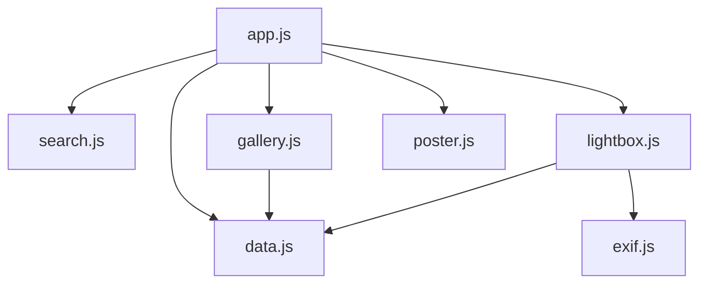

# Collection of Time · Photography

一个**零依赖**的静态摄影作品集框架：原生 HTML / CSS / JavaScript（ES Module），
内置相册分类浏览、标签搜索筛选、EXIF 元数据展示与灯箱大图查看，
并支持**照片与视频混合浏览**（本地视频文件 + YouTube / 哔哩哔哩 / Vimeo 外链嵌入）。

---

## 快速开始

```bash
cd CollectionOfTime/Photography
python serve.py          # 默认 http://127.0.0.1:8000，会自动打开浏览器
```

> 也可以使用其它任意静态服务器：`python -m http.server 8000`、`npx serve` 等。
> **不要直接双击 `index.html`**：`file://` 协议下浏览器会拦截 `fetch`，数据与 EXIF 都无法加载。

---

## 一键运行（run.sh）

`run.sh` 把「环境自检 → 装 FFmpeg → 建账号 → 启动服务」收成一条命令，
专为**部署到 Linux 服务器**准备（Windows 请在 WSL 或 Git Bash 里执行）。

```bash
cd CollectionOfTime/Photography
chmod +x run.sh          # 首次
./run.sh                 # 或 ./run.sh setup —— 首次部署一条龙
```

| 命令 | 作用 |
| --- | --- |
| `./run.sh setup` | 首次部署：环境自检 + 安装 FFmpeg + 启动 |
| `./run.sh start` | 后台启动（日志写入 `.run/admin.log`） |
| `./run.sh stop` / `restart` | 停止 / 重启 |
| `./run.sh status` | 运行状态、运行时长、FFmpeg 来源、数据条数 |
| `./run.sh logs [-f]` | 查看日志（`-f` 持续跟踪） |
| `./run.sh doctor` | 环境自检：Python 版本、必需文件、写权限、JSON 合法性、端口占用 |
| `./run.sh install-ffmpeg` | 下载 FFmpeg 静态构建到 `bin/`（可透传 `--check` / `--file` / `--url` 等） |
| `./run.sh create-user` / `reset-password` | 创建管理员 / 重置密码 |
| `./run.sh systemd [--install]` | 生成 systemd 单元（加 `--install` 需 root，直接写入并启用） |

启动参数可覆盖默认值（也支持环境变量）：

```bash
./run.sh start --port 9000 --host 0.0.0.0 --session-hours 8
PORT=9000 HOST=127.0.0.1 ./run.sh start
```

| 环境变量 | 默认值 | 说明 |
| --- | --- | --- |
| `PORT` | `8080` | 监听端口 |
| `HOST` | `127.0.0.1` | 监听地址（保持默认即可，见下方部署说明） |
| `SESSION_HOURS` | `12` | 会话有效期（小时） |
| `PYTHON` | 自动探测 | 指定解释器（需 3.9+） |
| `ADMIN_USERNAME` | `admin` | 非交互建号的用户名 |
| `ADMIN_PASSWORD` | — | 非交互建号的密码（至少 8 位） |
| `FFMPEG_URL` | — | 内网 FFmpeg 镜像地址 |

**无交互部署**（CI、容器、Ansible 等）只要给上账号密码，就不会弹任何提示：

```bash
ADMIN_USERNAME=me ADMIN_PASSWORD='你的密码' ./run.sh setup
```

脚本的几个贴心之处：

- 启动后**轮询 `/api/health` 直到真正就绪**才报成功，而不是「进程起来了就算成功」；
- 启动前检查端口是否被占用，并告诉你占用它的是谁；
- 重复执行 `start` 会提示已在运行，不会起出第二个实例；
- 没装 FFmpeg 时只警告不阻断，并提示修复命令；
- `stop` 先发 `SIGTERM`，最多等 10 秒再 `SIGKILL`。

---

## 打包与迁移到服务器

打包就是一条命令：

```bash
./run.sh package
```

产出一个自包含的 `dist/photography-linux-x64-<日期>-<时间>.tar.gz`，**解压即可运行**，
连 FFmpeg 静态构建都已在 `bin/` 里，服务器上无需 `apt install`、无需 `pip install`。

```bash
# 本地：上传
scp dist/photography-linux-x64-*.tar.gz* user@服务器:/tmp/

# 服务器：解压 + 跑起来
cd /tmp && sha256sum -c photography-linux-x64-*.tar.gz.sha256
sudo tar -xzf photography-linux-x64-*.tar.gz -C /opt
cd /opt/photography-linux-x64-* && chmod +x run.sh
./run.sh doctor          # 先自检
./run.sh setup           # 建号 + 启动
```

详细的服务器步骤、HTTPS 反代、systemd、升级与排查见包内的 **`DEPLOY.md`**。

### 打包参数

| 参数 | 说明 |
| --- | --- |
| `--platform <名字>` | 目标平台，默认 `linux-x64`（可选 `linux-arm64`、`linux-armhf`、`windows-x64`、`darwin-x64`） |
| `--out <目录>` | 输出目录，默认 `dist/` |
| `--no-ffmpeg` | 不打包 FFmpeg（服务器已装，或想自己放） |
| `--with-config` | 连 `admin.config.json` 一起打包，沿用现有账号密码 |
| `--keep-stage` | 保留组装用的临时目录，便于排查 |

### 包里有什么

除了完整代码，还多两份东西：

- **`PACKAGE-INFO.txt`**：打包时间、目标平台、包内 FFmpeg 版本、**三份 JSON 的条数与 sha256**。
  到了服务器上 `cat` 一下就能核对数据有没有在传输中损坏。
- **`DEPLOY.md`**：从建号到 systemd 常驻、从升到备份到排查的完整手册。

### 默认不打包什么

| 排除项 | 原因 |
| --- | --- |
| `admin.config.json` | 含密码哈希与会话密钥；到服务器上 `./run.sh create-user` 重新建号更干净 |
| `.run/`、`dist/`、`__pycache__/`、`*.pyc`、`*.log` | 运行时产物 |
| `data/.backups/` | 开发机上的历史备份，带过去没意义 |
| 另一种命名约定的 `ffmpeg.exe` / `ffmpeg` | 属于别的平台，白白占几十 MB |

需要连账号一起搬过去时加 `--with-config`。

### 打包时会做的检查

- 逐个确认必需文件齐全，缺了就中止并列出来；
- 核对 `bin/` 里的 FFmpeg 是不是目标平台的：扩展名不符直接排除，
  有 `file` 命令时还会提示「看着像 ARM 却要打 x64」这类疑惑；
- 生成 sha256 校验单，方便传到服务器后比对；
- 保留 `run.sh` 与 `bin/ffmpeg` 的可执行位——解压后无需额外 `chmod` 就能跑。

---

## FFmpeg 集成

FFmpeg 是**可选依赖**：没有它后台照样能用，只是跳过缩略图与视频封面生成。
为了让它能在没有 root、也不方便 `apt install` 的机器上工作，查找按优先级进行：

| 优先级 | 位置 | 说明 |
| --- | --- | --- |
| 1 | `COT_FFMPEG` / `COT_FFPROBE` 环境变量 | 指向任意位置的二进制（系统包、自编译版本） |
| 2 | 项目内 `bin/ffmpeg`、`bin/ffprobe` | 随项目一起打包，服务器上无需安装 |
| 3 | 系统 `PATH` | 已 `apt install ffmpeg` 时直接复用 |

后台「概览」页会显示实际来源（环境变量指定 / 项目内置 / 系统 PATH）、路径与版本号。

### 安装到 bin/

```bash
python tools/fetch_ffmpeg.py            # 自动识别平台，下载静态构建并解出到 bin/
python tools/fetch_ffmpeg.py --check     # 只看当前状态，不下载
```

支持 `linux-x64`、`linux-arm64`、`linux-armhf`、`windows-x64`、`windows-arm64`、`darwin-x64`。
解压时**按名字精确提取** `ffmpeg` / `ffprobe`，不做整包解压，天然免疫压缩包路径穿越。

| 参数 | 说明 |
| --- | --- |
| `--platform <名字>` | 为其它平台准备分发包（如 `windows-x64`），默认自动识别 |
| `--file <压缩包>` | 用本地压缩包，完全离线（`.tar.xz` / `.zip` 均可） |
| `--url <地址>` | 指向内网镜像，也支持 `file://` |
| `--sha256 <哈希>` | 校验压缩包，不匹配就中止且不覆盖已有文件 |
| `--dest <目录>` | 安装到别处（默认 `bin/`） |
| `--force` | 覆盖已存在的文件 |
| `--keep-archive` | 保留下载的压缩包，便于分发给其它机器 |

安装后脚本会自己跑一次 `-version`，确认二进制**真能执行**；架构不匹配时会在安装阶段就报出来，
而不是等你上传视频才发现。

### 打包到服务器

`bin/` 目录下的二进制已被 `.gitignore` 排除（只保留说明文件），所以走实际部署流程时：

```bash
# 在开发机上为目标平台准备（例如服务器是 x86_64 Linux）
python tools/fetch_ffmpeg.py --platform linux-x64

# 连二进制一起传过去
rsync -av --exclude '.run' --exclude 'admin.config.json' Photography/ user@server:/opt/photography/

# 服务器上确认
cd /opt/photography && ./run.sh doctor
```

> **信任提示**：默认下载源是第三方提供的静态构建（Linux 用 johnvansickle.com，
> Windows 用 BtbN 的 GitHub Release，macOS 用 evermeet.cx）。对来源有要求时，
> 请自行编译或用发行版包，然后通过 `COT_FFMPEG` / `COT_FFPROBE` 指向，
> 或者把校验过的压缩包放进项目用 `--file` 安装。

---

## 内容后台（admin.py）

一个**只用 Python 标准库**的内容后台，采用前后端分离结构：

- **后端** `admin.py`：只提供 JSON API 与（可选的）静态资源，负责认证、校验与落盘；
- **前端** `admin/`：纯静态的 SPA，通过 `fetch` 调 API，可独立部署。

服务器上不需要 `pip install` 任何东西。

```bash
python admin.py --create-user         # 首次：创建管理员账号
python admin.py                       # 启动，默认 http://127.0.0.1:8080/admin/
python admin.py --port 9000 --session-hours 8
python admin.py --print-systemd       # 生成 systemd 单元文件
```

打开 `http://127.0.0.1:8080/admin/`，用刚创建的账号登录即可。

### 能做什么

| 模块 | 能力 |
| --- | --- |
| 概览 | 条目计数、FFmpeg 状态、**数据完整性体检**（失效相册引用 / 缺失媒体文件）、最近操作 |
| 照片 / 视频 / 相册 | 列表筛选、新增、编辑（含 EXIF 分组表单）、删除（可选同时删除媒体文件） |
| 上传 | 拖拽或点选多文件、指定相册与标签、**自动读取 EXIF 填充拍摄参数**、ffmpeg 生成缩略图与视频封面 |
| 备份 | 一键导出 JSON、导入（覆盖 / 按 id 合并）、回滚任意一次自动备份 |
| 账号 | 修改密码、退出登录、会话信息 |

### 登录与认证

登录页是后台的唯一入口，认证做了这几件事：

| 项目 | 实现 |
| --- | --- |
| 密码存储 | PBKDF2-HMAC-SHA256，30 万次迭代 + 16 字节随机盐，只存哈希 |
| 会话 | 服务端 HMAC-SHA256 签名的令牌，默认 12 小时有效（`--session-hours`） |
| 会话 Cookie | `HttpOnly` + `SameSite=Strict`，前端 JS 读不到令牌 |
| CSRF | 双提交：可读的 `cot_csrf` Cookie 必须回填到 `X-CSRF-Token` 头，所有写操作都校验 |
| 登录限流 | 同一「IP + 用户名」在 5 分钟内失败 5 次即锁定 5 分钟，锁定期间密码正确也拒绝 |
| 改密 | 需要校验当前密码；改密后**其它设备的所有会话立即失效** |
| 账号枚举防护 | 用户不存在时也走一次哈希运算，避免通过响应耗时区分 |

首次使用有三种建号方式：

```bash
python admin.py --create-user                        # 命令行交互创建
ADMIN_USERNAME=me ADMIN_PASSWORD='...' python admin.py --create-user   # 非交互
./run.sh create-user                                 # 同样支持上面两个环境变量
```

或者直接打开后台界面，会引导你创建（只在还没有账号时可用）。
忘记密码时在服务器上重置：

```bash
python admin.py --reset-password
ADMIN_PASSWORD='新密码' ./run.sh reset-password        # 非交互
```

账号与会话密钥保存在 `admin.config.json`（权限 `0600`，已在 `.gitignore` 中忽略）。

### 前后端分离与 API

前端通过 `admin/js/config.js` 决定接口地址，默认同源（空字符串）。
要指向另一台服务器，改 `admin/index.html` 里的 meta 即可，**前端代码无需改动**：

```html
<meta name="api-base" content="https://api.example.com" />
```

跨域时后端需要加白名单（带 Cookie 的跨域必须回具体 Origin，不能用 `*`）：

```bash
python admin.py --host 0.0.0.0 --allow-origin https://admin.example.com
```

主要接口：

| 接口 | 说明 |
| --- | --- |
| `GET /api/auth/session` | 当前登录状态、是否需要初始化、并下发 CSRF Cookie |
| `POST /api/auth/setup` | 首次创建管理员（仅在无账号时可用） |
| `POST /api/auth/login` | 登录 |
| `POST /api/auth/logout` | 退出 |
| `POST /api/auth/password` | 修改密码 |
| `GET /api/state` | 概览：计数、工具状态、完整性体检、备份列表、操作记录 |
| `GET /api/data/{albums\|photos\|videos}` | 读取集合 |
| `PUT /api/data/{集合}` | 整表替换 |
| `POST /api/data/{集合}` | 新增 / 按 id 覆盖单条 |
| `DELETE /api/data/{集合}/{id}[/file]` | 删除条目；加 `/file` 同时删除媒体文件 |
| `POST /api/upload` | multipart 上传（自动 EXIF / 缩略图 / 视频封面） |
| `GET /api/backups`、`POST /api/backups/{名称}/restore` | 列出 / 恢复备份 |
| `GET /api/export`、`POST /api/import` | 导出 / 导入 JSON |
| `GET /api/health` | 健康检查（无需登录） |

### 安全模型

写操作会改文件，因此默认收敛：

- 默认只监听 `127.0.0.1`，外部访问不到；
- 除公开接口外，所有 API 都要求有效会话；
- 上传有扩展名白名单、单文件 512MB 上限；
- 删除文件前会做路径越界校验，只允许删 `assets/` 下的对应目录；
- 静态资源与 `/admin` 资源都做了路径穿越防护；
- `--no-auth` 只在监听本机时才允许使用（本地调试用）。

### 服务器部署

> 从零部署建议走「`./run.sh package` 打包 → 上传 → 解压 → `./run.sh setup`」这条路，
> 步骤见上一节与包内 `DEPLOY.md`。下面是几种运行方式的对照。

**方式一：SSH 端口转发（推荐，最省事也最安全）**

服务只监听本机，通过 SSH 隧道访问，不暴露任何公网端口：

```bash
# 服务器上
cd /path/to/Photography && ./run.sh start      # 或 ./run.sh setup 首次部署

# 本地电脑上建立隧道
ssh -N -L 8080:127.0.0.1:8080 user@your-server

# 然后浏览器打开 http://127.0.0.1:8080/admin/
```

不习惯记命令也可以先 `./run.sh status` 看一眼当前端口和地址。

**方式二：对外监听 + HTTPS 反代**

```bash
python admin.py --host 0.0.0.0 --port 8080 --secure-cookie
```

必须放在 HTTPS 反向代理之后，否则会话 Cookie 与密码会以明文传输：

```nginx
location /admin/ { proxy_pass http://127.0.0.1:8080; proxy_set_header Host $host; }
location /api/   { proxy_pass http://127.0.0.1:8080; proxy_set_header Host $host; }
location /       { root /path/to/Photography; }
```

> 反代会自动识别 `X-Forwarded-Proto: https` 并加上 `Secure` 标记（`--secure-cookie` 可强制开启），
> 所以 nginx 配置里记得同时转发 `proxy_set_header X-Forwarded-Proto $scheme;`。

**方式三：systemd 常驻**

```bash
python admin.py --port 8080 --print-systemd | sudo tee /etc/systemd/system/photography-admin.service
sudo systemctl daemon-reload && sudo systemctl enable --now photography-admin
```

用 `run.sh` 更省事（会自动写入路径、单元名与当前解释器）：

```bash
sudo ./run.sh systemd --install
```

### 数据安全

后台的每一次保存都做了三层保护：

1. 保存前把现有文件复制到 `data/.backups/`（保留最近 40 份，文件名带时间戳）；
2. 校验通过才写：id 必须唯一且非空，结构必须是数组，相册引用错误只提示不阻断；
3. 「写临时文件 + `os.replace`」原子替换，进程被 kill 也不会留下半截 JSON。

改动想撤销时，在后台「备份」页点一下对应备份的**恢复**即可（恢复前还会再存一份当前状态，可反复回滚）。

### 上传时的自动化

- **图片**：解析 JPEG 的 APP1 段，自动填充 `camera` / `lens` / `focalLength` / `aperture` / `shutter` / `iso` /
  `dimensions`，并用 `dateTimeOriginal` 作为条目的 `date`；有 ffmpeg 时额外生成 800px 缩略图。
- **视频**：用 ffprobe 读取时长 / 分辨率 / 帧率 / 编码，用 ffmpeg 在「2 秒」与「时长 10%」中取较早的时间点抓帧作封面。
- **没装 ffmpeg 也能用**：跳过缩略图与封面，返回明确的警告提示，其余流程照常。上传超大图时还会提醒你图片会拖慢加载。
- 启动时就会检测 FFmpeg（而不是上传时才检测），装错架构的二进制会被及时识别为不可用。

---

## 目录结构

```
Photography/
├── index.html                # 站点入口页：结构 + 灯箱骨架
├── admin.py                  # 后台后端：JSON API + 认证 + 上传 + 落盘
├── serve.py                  # 纯静态预览服务器
├── run.sh                    # 一键运行（自检 / 装 FFmpeg / 打包 / 启动 / 日志）
├── DEPLOY.md                 # 部署到服务器的完整手册（随迁移包分发）
├── admin.config.json         # 管理员账号与会话密钥（0600 权限，已 gitignore）
├── adminlib/                 # 后台的服务端模块
│   ├── auth.py               # 密码哈希、签名会话、CSRF、登录限流
│   ├── store.py              # JSON 读写、校验、原子写入、自动备份
│   ├── exifread.py           # 标准库 JPEG EXIF 解析
│   └── media.py              # ffmpeg / ffprobe 封装与多位置探测（可选）
├── admin/                    # 后台前端（纯静态 SPA，可独立部署）
│   ├── index.html            # 登录视图 + 后台视图
│   ├── css/{base.css, login.css, admin.css}
│   └── js/
│       ├── config.js         # 接口地址等运行时配置
│       ├── api.js            # API 客户端（凭证 / CSRF / 错误处理）
│       ├── auth.js           # 登录、建号、改密、登出
│       ├── ui.js             # DOM 工具、提示、弹窗、表单
│       ├── views.js          # 纯渲染函数
│       └── app.js            # 状态与事件装配
├── tools/
│   ├── make_posters.py       # 用 ffmpeg 批量生成视频封面
│   └── fetch_ffmpeg.py       # 下载 / 校验 / 安装 FFmpeg 静态构建到 bin/
├── bin/                      # 内置 ffmpeg、ffprobe（已 gitignore，只保留 README）
├── data/
│   ├── albums.json           # 相册数据
│   ├── photos.json           # 照片数据（含 EXIF）
│   ├── videos.json           # 视频数据（本地文件或外链嵌入）
│   └── .backups/             # 保存前自动生成的备份（已 gitignore）
├── assets/
│   ├── css/{main.css, lightbox.css}
│   ├── js/{app.js, data.js, search.js, gallery.js, lightbox.js, poster.js, exif.js}
│   ├── img/                  # 照片资源（当前为 SVG 占位图）
│   └── video/                # 视频资源，详见 assets/video/README.md
├── .run/                     # 运行状态：admin.pid、admin.log（已 gitignore）
├── dist/                     # 打包产物 photography-<平台>-<时间>.tar.gz（已 gitignore）
└── .gitignore
```

### 模块依赖关系



---

## 数据格式

### `data/albums.json`

| 字段 | 类型 | 说明 |
| --- | --- | --- |
| `id` | string | 相册唯一标识，与照片的 `album` 对应 |
| `name` | string | 相册名称 |
| `description` | string | 一句话描述（作为悬浮提示） |
| `cover` | string | 封面图路径 |

### `data/photos.json`

| 字段 | 类型 | 说明 |
| --- | --- | --- |
| `id` | string | 作品唯一标识 |
| `title` | string | 标题 |
| `album` | string | 所属相册 id |
| `src` | string | 大图路径（灯箱使用） |
| `thumb` | string | 缩略图路径（网格使用），省略则回退到 `src` |
| `date` | string | 拍摄时间，`YYYY-MM-DD HH:mm:ss` |
| `location` | string | 地点 |
| `description` | string | 描述 |
| `tags` | string[] | 标签，参与搜索与筛选 |
| `exif` | object | 拍摄参数，见下 |

`exif` 可选字段：`camera`、`lens`、`focalLength`、`aperture`、`shutter`、`iso`、
`dateTimeOriginal`、`dimensions`。字段缺失时会自动跳过，不会报错。

### `data/videos.json`

| 字段 | 类型 | 说明 |
| --- | --- | --- |
| `id` | string | 唯一标识 |
| `title` | string | 标题 |
| `album` | string | 所属相册 id（与照片共用同一套相册） |
| `provider` | string | `file`（本地文件）\| `youtube` \| `bilibili` \| `vimeo` \| `embed` |
| `src` | string | `provider: "file"` 时为文件路径；否则填视频链接或视频 ID |
| `poster` | string | 封面图路径（外链视频必填） |
| `posterTime` | number | 运行时抓帧的时间点（秒），默认 `2` |
| `duration` | number \| string | 时长，可写 `48`、`"00:48"`、`"1:02:33"` |
| `resolution` | string | 分辨率，如 `"3840 × 2160"` |
| `date` / `location` / `description` / `tags` | — | 与照片同义，参与搜索与筛选 |
| `exif` | object | 视频参数，常用 `camera`、`lens`、`fps`、`codec` |

`provider` 为外链时会自动把常见的观看链接转成嵌入地址，以下写法都支持：

| 填写的 `src` | 转换后的嵌入地址 |
| --- | --- |
| `https://www.youtube.com/watch?v=VIDEOID` | `https://www.youtube.com/embed/VIDEOID?rel=0` |
| `https://youtu.be/VIDEOID` | 同上 |
| `https://www.bilibili.com/video/BV1xxxxxxxxx` | `https://player.bilibili.com/player.html?bvid=BV1xxxxxxxxx` |
| `BV1xxxxxxxxx`（直接填 ID） | 同上 |
| `https://vimeo.com/123456789` | `https://player.vimeo.com/video/123456789` |

---

## 视频支持

- **统一网格**：照片与视频在同一个网格里按时间排序，卡片上以播放按钮 + 时长角标区分，
  工具栏「类型」chips 可一键只看照片或只看视频。
- **两种播放方式**：本地文件用原生 `<video controls>`；外链用 `<iframe>` 嵌入播放器，
  自动转换链接格式。切换媒体时会自动暂停并卸载上一个播放器，避免后台继续播放。
- **自动封面**（二选一）：
  - 预生成：`python tools/make_posters.py` 用 ffmpeg 抓帧，加载最快；
  - 运行时：`poster` 留空，`assets/js/poster.js` 在卡片进入视口时定位到 `posterTime` 秒显示该帧。
- **视频参数面板**：灯箱中展示来源、时长、分辨率、帧率、编码、设备与地点。
- **键盘**：`Esc` 关闭、`←` `→` 翻页；当播放器或表单控件获得焦点时，方向键让给控件自身
  （便于拖动进度条）。

> 外链嵌入的视频**必须**提供 `poster`：跨域 iframe 的画面无法被读取。
> 详见 `assets/video/README.md`。

---

## 新增一张照片

1. 把导出的图片放进 `assets/img/photos/`（缩略图放 `assets/img/photos/thumbs/`）。
2. 在 `data/photos.json` 中追加一条记录，填写 `src` / `thumb` / `tags` / `exif`。
3. 刷新页面即可，**无需任何构建步骤**。

灯箱中的「解析原文件 EXIF」按钮会真正读取 JPEG 的 APP1 段（`assets/js/exif.js`），
因此即使 JSON 里没写 EXIF，也能从原图里解析出相机、快门、光圈、ISO 等参数。

## 新增一段视频

1. 压缩导出后放进 `assets/video/`（原始素材放 `assets/video/originals/`，已被 git 忽略）。
2. 生成封面：`python tools/make_posters.py --json`，把输出的片段粘进 `data/videos.json`。
3. 补全 `title` / `album` / `date` / `tags` 等字段；外链视频改成
   `"provider": "bilibili"` + `"src": "BV..."` 并在 `poster` 指向一张封面图。
4. 刷新页面即可。

---

## 已实现的功能

- **相册分类浏览**：顶部相册卡片总览 + 工具栏相册 chips，点击即可筛选（再次点击取消）。
- **类型筛选**：全部 / 照片 / 视频，带实时数量。
- **标签与关键词搜索**：多标签「与」逻辑；关键词空格分隔，多个关键词「与」匹配；
  搜索覆盖标题、地点、描述、相机、镜头、分辨率与标签。
- **排序**：拍摄时间升降序、标题字典序、相册分组。
- **灯箱**：照片与视频统一查看，键盘 `Esc` / `←` / `→`、点击图片两侧翻页、
  相邻媒体预加载、焦点陷阱。
- **EXIF 展示**：优先使用 JSON 中的数据，可按需从原图实时解析。
- **视频自动封面**：预生成与运行时抓帧两条路径。
- **主题切换**：深色 / 浅色，写入 `localStorage` 记忆。
- **快捷键**：`/` 聚焦搜索框。
- **响应式与无障碍**：移动端自适应网格、`aria-pressed` 状态、`prefers-reduced-motion` 支持。
- **内容后台**：零依赖的 Python 后台，登录认证 + 增删改查 + 上传 + EXIF 自动填充 + 自动备份与回滚。
- **FFmpeg 集成**：三级查找（环境变量 / 项目 `bin/` / 系统 PATH），一条命令装静态构建并随项目打包。
- **一键运行**：`run.sh` 把自检、装依赖、打包、建号、启动、看日志、装 systemd 收在一起。
- **打包迁移**：`./run.sh package` 生成自包含的 tar.gz（含 FFmpeg），解压即可在服务器上运行。

---

## 后续可扩展方向

- 后台增加批量编辑（多选改相册 / 加标签）与拖拽排序。
- 登录增加 TOTP 双因素认证，以及「记住我」的长期会话。
- 引入内容安全策略（CSP）响应头，进一步收紧前端可执行范围。
- 用视频 HLS 分片（`.m3u8`）承载长视频，按需加载不同码率。
- 引入 EXIF 缩略图作为首屏占位（低质量图片占位符 LQIP）。
- 增加 URL 查询参数同步（如 `?album=street&type=video`），便于分享筛选结果。
- 用 `IntersectionObserver` 实现滚动分页，支撑上千个条目。
